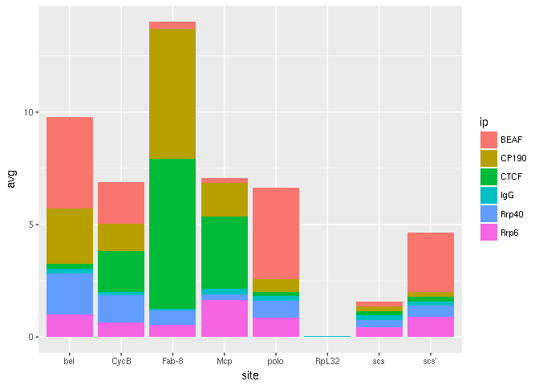
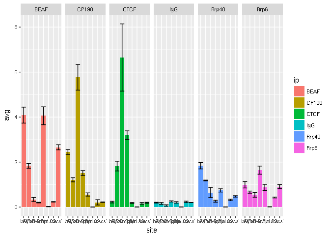
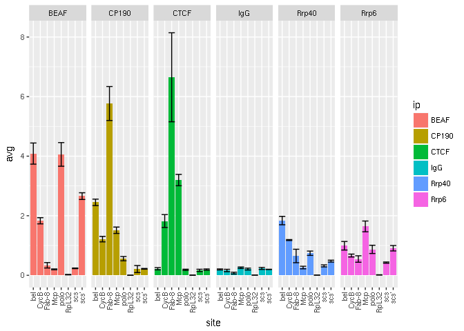
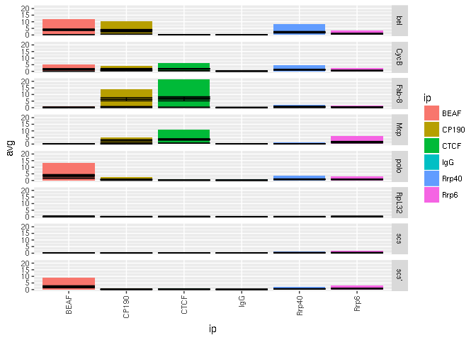
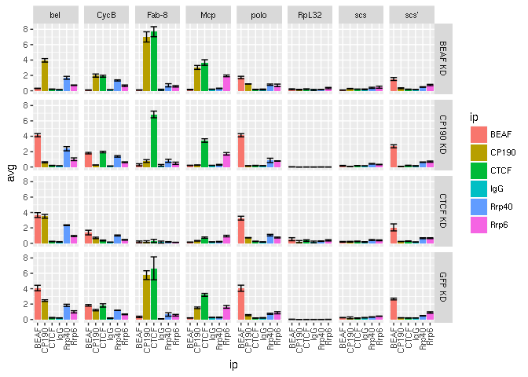
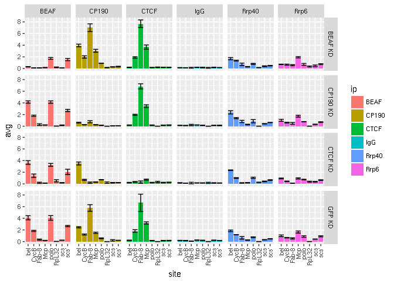
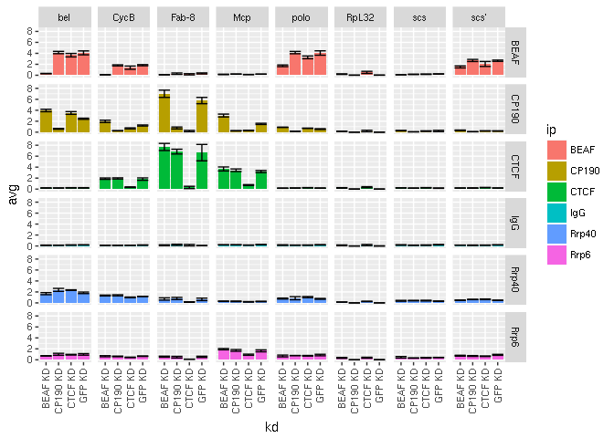
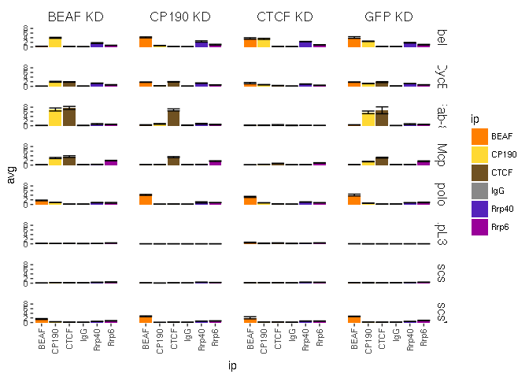
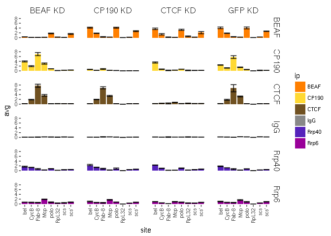

# ggplot2 qPCR
Ryan Dale  
# Visualizing ChIP qPCR experiments with ggplot2

This worked example shows how to visualize a common type of experiment with
ggplot2. These types of experiments are an investment in time and effort, and
it's important to visualize the data in the best way you can, rather than
tossing it into Excel for a quick plot.

As this example demonstrates, plotting the exact same data in different ways
can highlight different aspects of the data. This is extremely important for
extracting the most information out of your experiments.

## Data description
Data are from Figure 6 of Lim et al 2013.  These are ChIP qPCR data with
6 different antibodies:

- CP190
- CTCF
- BEAF
- Rrp40
- Rrp6
- IgG

Each ChIP was performed at the following 8 loci:

- scs
- scs'
- Mcp
- Fab-8
- polo
- CycB
- bel
- RpL32

Each IP at each site was performed in triplicate under the following knockdown
conditions:

- CP190 KD
- BEAF KD
- CTCF KD
- GFP KD

The data we have are percent input, stored as averages of 3 replicates with
stddev. This is a 4-dimensional data set: we have percent input for each
combination of locus, antibody, and knockdown.

The published figure can be found here:
https://academic.oup.com/view-large/figure/83606351/gkt037f6p.jpeg. The paper
concludes that "CTCF is specifically required for exosome chromatin association
at Fab-8 and Mcp."

Can we improve on this figure? Or, more generally, how can we explore this kind
of multi-dimensional data?


```r
library(ggplot2)
df <- read.table('knockdown-ChIP-data.txt', header=TRUE, stringsAsFactors=FALSE)
head(df)
```

```
##     ip  site       kd       avg     stddev
## 1 BEAF  scs' CP190 KD 2.6961925 0.19479934
## 2 BEAF   scs CP190 KD 0.1633209 0.04662852
## 3 BEAF   Mcp CP190 KD 0.2093105 0.01861839
## 4 BEAF Fab-8 CP190 KD 0.2852451 0.13260693
## 5 BEAF  polo CP190 KD 4.1365283 0.20923257
## 6 BEAF  CycB CP190 KD 1.8053774 0.10202840
```

For now, let's  just look at GFP KD to practice and get a handle on antibody
and site differences:


```r
df.gfp <- df[df$kd == 'GFP KD',]
```

The plot is stacking the IPs on top of each other for each site. It's somewhat
informative: nothing at RpL32 as we'd expect for a negative control; lots of
CP190 and CTCF at Fab-8 (it's a known insulator site):


```r
ggplot(df.gfp) +
    geom_col(mapping=aes(x=site, y=avg, fill=ip))
```

<!-- -->

We have stddev calculated in the column `stddev`. Here's how to add error bars
(`geom_errorbar`). However, adding errorbars to this stacked plot isn't useful:
the errobar ymin and ymax would need to have offsets calculated to take into
account the stacking:


```r
ggplot(df.gfp) +
    geom_col(mapping=aes(x=site, y=avg, fill=ip)) +

    # add errorbars
    geom_errorbar(aes(x=site, ymax=avg + stddev, ymin=avg - stddev))
```

<!-- -->

We could manually calculate the positions of the error bars, but that would get
annoying. Instead, let's fix the problem where we have all antibodies on top of
each other and instead split them out into separate panels. It's much less
obvious now that RpL32 has low ChIP signal, but we do see that CTCF and CP190
are quite high at Fab-8:


```r
ggplot(df.gfp) +
    geom_col(mapping=aes(x=site, y=avg, fill=ip)) +
    geom_errorbar(aes(x=site, ymax=avg + stddev, ymin=avg - stddev)) +

    # add faceting
    facet_grid(.~ip)
```

<!-- -->

The text might be jumbled on the x-axis. Here's the fix:


```r
ggplot(df.gfp) +
    geom_col(mapping=aes(x=site, y=avg, fill=ip)) +
    geom_errorbar(aes(x=site, ymax=avg + stddev, ymin=avg - stddev)) +
    facet_grid(.~ip) +

    # make x-axis labels vertical
    theme(axis.text.x=element_text(angle=90, hjust=1, vjust=0.5))
```

<!-- -->

The great part about ggplot is that we can completely change the organization
of the plot with small changes to the code. Here, the only thing we're doing is
swapping aesthetic `x` from site to IP, and faceting by IP instead of site. Now
it's much clearer that RpL32 is very low.


```r
# save the theme changes
my_theme <- theme(axis.text.x=element_text(angle=90, hjust=1, vjust=0.5))

ggplot(df.gfp) +
    geom_col(mapping=aes(x=ip, y=avg, fill=ip)) +
    geom_errorbar(aes(x=ip, ymax=avg + stddev, ymin=avg - stddev)) +

    # was: facet_grid(.~ip):
    facet_grid(.~site) +

    # add the theme
    my_theme
```

<!-- -->

It would probably look better to go tall and narrow so that the colors line up
vertically. This really highlights how scs' only has BEAF. We only need to
tweak the faceting:


```r
ggplot(df.gfp) +
    geom_col(mapping=aes(x=ip, y=avg, fill=ip)) +
    geom_errorbar(aes(x=ip, ymax=avg + stddev, ymin=avg - stddev)) +

    # was: facet_grid(.~site)
    facet_grid(site~.) +
    my_theme
```

<!-- -->

Everything we've looked at so far is only for the control (GFP KD). Now if we
change the dataset we're using (`df` instead of `df.gfp`). it stacks up all the
knockdowns and again the errorbars are funky:


```r
# was: ggplot(df.gfp)
ggplot(df) +

    geom_col(mapping=aes(x=ip, y=avg, fill=ip)) +
    geom_errorbar(aes(x=ip, ymax=avg + stddev, ymin=avg - stddev)) +
    facet_grid(site~.) +
    my_theme
```

<!-- -->

So let's add knockdown to the faceting. We just added 3x more data, which is
why it's starting to look complicated. That said, we can start to see some
patterns, like when a protein is knocked down its signal goes down (with the
exception of BEAF at scs'):


```r
ggplot(df) +
    geom_col(mapping=aes(x=ip, y=avg, fill=ip)) +
    geom_errorbar(aes(x=ip, ymax=avg + stddev, ymin=avg - stddev)) +

    # was: facet_grid(site~.)
    facet_grid(site~kd) +
    my_theme
```

<!-- -->

Here we flip the faceting, so that the colors line up. I think this is an
improvement over the last:


```r
ggplot(df) +
    geom_col(mapping=aes(x=ip, y=avg, fill=ip)) +
    geom_errorbar(aes(x=ip, ymax=avg + stddev, ymin=avg - stddev)) +

    # was: facet_grid(site~kd)
    facet_grid(kd~site) +
    my_theme
```

<!-- -->

Let's continue exploring. This time, let's swap site for IP in the x and in the
faceting.


```r
ggplot(df) +
    # was:
    # geom_col(mapping=aes(x=ip, y=avg, fill=ip)) +
    geom_col(mapping=aes(x=site, y=avg, fill=ip)) +
    geom_errorbar(aes(x=site, ymax=avg + stddev, ymin=avg - stddev)) +

    # was:
    # facet_grid(kd~site)
    facet_grid(kd~ip) +
    my_theme
```

<!-- -->
I think I like this one the best: swap knockdown and site in the x and in the
faceting:


```r
ggplot(df) +

    # was:
    # geom_col(mapping=aes(x=site, y=avg, fill=ip)) +
    geom_col(mapping=aes(x=kd, y=avg, fill=ip)) +
    geom_errorbar(aes(x=kd, ymax=avg + stddev, ymin=avg - stddev)) +

    # was:
    # facet_grid(kd~ip)
    facet_grid(ip~site) +
    my_theme
```

<!-- -->

The following is a bunch of tweaks to make it nicer-looking:


```r
# Nicer colors. There are lots of color palette sites you can use for
# inspiration. Since we're aiming to highlight Rrp6 and Rrp40, they are on
# a different part of the color wheel than the insulator proteins
cols <- c(
          "BEAF"="#FF7F00",
          "CP190"="#FFD933",
          "IgG"="#888888",
          "Rrp40"="#5522bb",
          "Rrp6"="#990099",
          "CTCF"="#705121")
ggplot(df) +
    geom_col(mapping=aes(x=ip, y=avg, fill=ip)) +
    geom_errorbar(aes(x=ip, ymax=avg + stddev, ymin=avg - stddev)) +
    facet_grid(site~kd) +

    # Manually set the colors
    scale_fill_manual(values=cols) +

    # ggplot2 has a built-in black-and-white theme, that we're using to start
    # with:
    theme_bw() +
    theme(
          # our vertical x-axis labels from before
          axis.text.x=element_text(angle=90, hjust=1, vjust=0.5),

          # Don't shade the "strips", which are the panel row and column
          # labels.
          strip.background=element_rect(fill = NA, colour = NA),

          # Turn off the grids
          panel.grid.minor=element_blank(),
          panel.grid.major=element_blank(),

          # Change the text size in the strips
          strip.text=element_text(size=12),

          # Tweak the spacing between panels
          panel.border=element_blank(), panel.spacing=unit(1.5, "lines")
          ) +

    # Rename the x and y axis labels
    labs(y="Percent input", x='Antibody')
```

<!-- -->

We can pull out the theme so we can reuse it without typing everything out:

```r
my_theme <- theme(axis.text.x=element_text(color=NULL)) +
    theme_bw() +
    theme(
          axis.text.x=element_text(angle=90, hjust=1, vjust=0.5),
          strip.background=element_rect(fill = NA, colour = NA),
          panel.grid.minor=element_blank(),
          panel.grid.major=element_blank(),
          strip.text=element_text(size=12),
          panel.border=element_blank(), panel.spacing=unit(1.5, "lines")
    )
```

Now we can just add it to the end:

```r
ggplot(df) +
    geom_col(mapping=aes(x=ip, y=avg, fill=ip)) +
    geom_errorbar(aes(x=ip, ymax=avg + stddev, ymin=avg - stddev)) +
    scale_fill_manual(values=cols) +
    facet_grid(site~kd) +

    # was that long "theme" section:
    my_theme
```

<!-- -->


```r
ggplot(df) +

    # was:
    # geom_col(mapping=aes(x=ip, y=avg, fill=ip)) +
    geom_col(mapping=aes(x=site, y=avg, fill=ip)) +
    geom_errorbar(aes(x=site, ymax=avg + stddev, ymin=avg - stddev)) +
    scale_fill_manual(values=cols) +

    # was:
    # facet_grid(site~kd)
    facet_grid(ip~kd) +
    my_theme
```

<!-- -->

I think I like this one in the end. It shows that Mcp also shows that Rrp6 requires CTCF at Mcp (no

```r
ggplot(df) +
    geom_col(mapping=aes(x=kd, y=avg, fill=ip)) +
    geom_errorbar(aes(x=kd, ymax=avg + stddev, ymin=avg - stddev)) +
    scale_fill_manual(values=cols) +

    # was:
    # facet_grid(ip~kd) +
    facet_grid(ip~site) +
    my_theme
```

<!-- -->

Compare it with the original:

```r
df$kd <- factor(df$kd, levels=c('GFP KD', 'BEAF KD', 'CP190 KD', 'CTCF KD'))
dodge <- position_dodge(width=.9)
ggplot(df) +
    aes(x=site, y=avg, ymax=avg+stddev, ymin=avg-stddev, fill=kd) +
    geom_col(position=dodge) +
    geom_errorbar(position=dodge, width=0.25)+
    scale_fill_manual(values=c(
        'GFP KD'='#000000',
        'BEAF KD'='#444444',
        'CP190 KD'='#999999',
        'CTCF KD'='#CCCCCC'
        ), limits=c('GFP KD', 'BEAF KD', 'CP190 KD', 'CTCF KD'))+
    facet_wrap(~ip) + my_theme
```

<!-- -->
